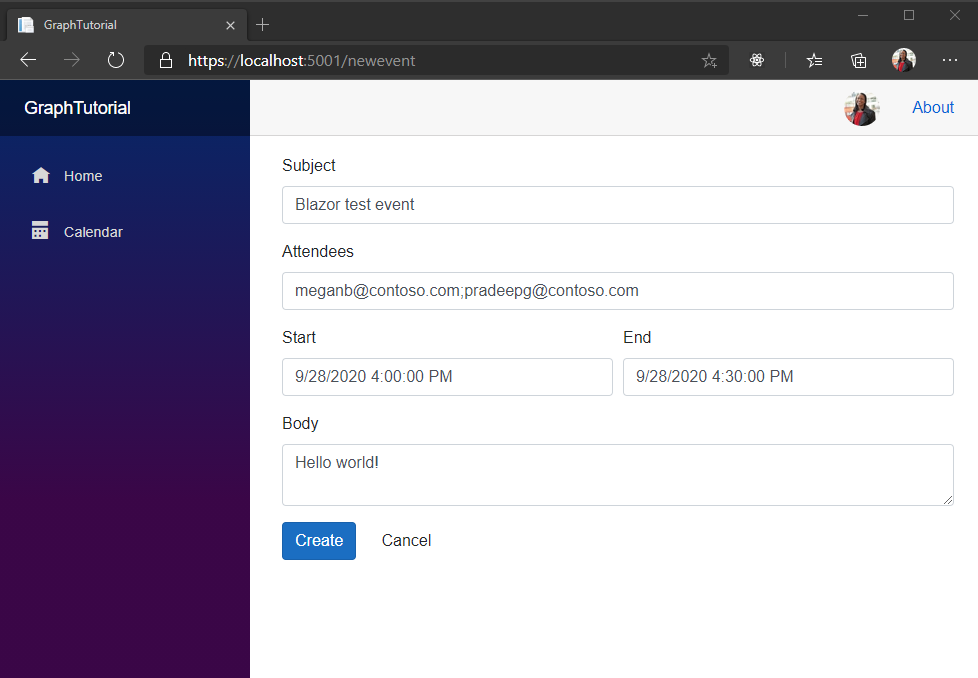

<!-- markdownlint-disable MD002 MD041 -->

В этом разделе вы добавим возможность создания событий в календаре пользователя.In this section you will add the ability to create events on the user's calendar.

1. Создайте файл в **каталоге ./Pages** с именем **NewEvent.веб-сайт и** добавьте следующий код.Create a new file in the **./Pages** directory named **NewEvent.razor** and add the following code.

    :::code language="razor" source="../demo/GraphTutorial/Pages/NewEvent.razor" id="NewEventFormSnippet":::

    При этом форма добавляется на страницу, чтобы пользователь ввести значения для нового события.This adds a form to the page so the user can enter values for the new event.

1. Добавьте следующий код в конец файла.Add the following code to the end of the file.

    :::code language="razor" source="../demo/GraphTutorial/Pages/NewEvent.razor" id="NewEventCodeSnippet":::

    Подумайте, что делает этот код.Consider what this code does.

    - В `OnInitializedAsync` нем возвращается часовой пояс пользователя, для проверки подлинности.In `OnInitializedAsync` it gets the authenticated user's time zone.
    - В `CreateEvent` нем инициализируется **новый объект Event** с использованием значений из формы.In `CreateEvent` it initializes a new **Event** object using the values from the form.
    - Он использует SDK Graph для добавления события в календарь пользователя.It uses the Graph SDK to add the event to the user's calendar.

1. Сохраните все изменения и перезапустите приложение.Save all of your changes and restart the app. На странице **"Календарь"** выберите **"Новое событие".**On the **Calendar** page, select **New event**. Заполните форму и выберите **"Создать".**Fill in the form and choose **Create**.

    
